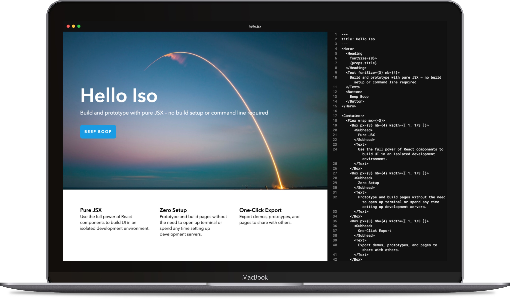

# Iso

Build and prototype with pure JSX – no build setup or command line required



- [Download Iso][download]
- [Documentation][docs]

---

- Prototype with React components
- Create layouts using only JSX
- No command line required
- No build setup
- Configurable component libraries
- Configurable themes
- Support for [styled-components][sc]

---

## Contributing

### Development

Install dependencies

```sh
npm i
```

Compile source code for the renderer process

```sh
npm run watch
```

Start the electron app

```sh
npm start
```

---

### Migrating from previous Iso versions (below v0.1.0)

Iso v0.1.0 includes breaking changes for how JSX files and configurations work.
If you've used a previous version of Iso, see the [Migration Guide](docs/migration.md) for more information.

---

[Made by Compositor](https://compositor.io)
|
[MIT License](LICENSE.md)

[sc]: https://github.com/styled-components/styled-components
[download]: https://iso.c8r.io
[docs]: docs/

